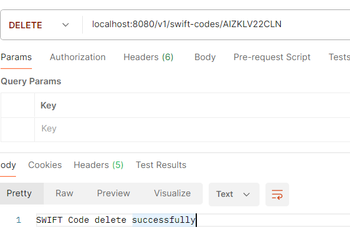

# SWIFT Codes API

## Table of Contents

- [Project Description](#project-description)
- [Technologies Used](#technologies-used)
- [Setup and Installation](#setup-and-installation)
- [API Endpoints](#api-endpoints)
    - [Retrieve Details of a Single SWIFT Code](#retrieve-details-of-a-single-swift-code)
    - [Get All SWIFT Codes for a Country](#get-all-swift-codes-for-a-country)
    - [Add a New SWIFT Code](#add-a-new-swift-code)
    - [Delete a SWIFT Code](#delete-a-swift-code)
- [Error Handling](#error-handling)
---

## Project Description

This application provides a REST API to store and manage SWIFT codes, making SWIFT-related data 
accessible via HTTP endpoints. The system allows retrieving, adding, and deleting SWIFT codes 
while maintaining structured data storage in a database.

## Technologies Used

- Java 17
- Spring Boot 3.4.3
- Spring Data JPA
- H2 Database
- Maven
- OpenCSV (for CSV parsing)
- JUnit & Spring Boot Test (for testing)

## Setup and Installation

1. Clone the repository:

   git clone https://github.com/Deslej/Remitly.git

2. Build the application using jar:
   If you're in the Remitly directory, use the following command in cmd:
    java -jar target\Remitly-0.0.1-SNAPSHOT.jar

3. The API should now be available at `http://localhost:8080`

## API Endpoints

### Retrieve Details of a Single SWIFT Code

**GET** `/v1/swift-codes/{swift-code}`

**Response for Headquarters:**

**Response for Branch:**

### Get All SWIFT Codes for a Country

**GET** `/v1/swift-codes/country/{countryISO2code}`

**Response:**

### Add a New SWIFT Code

**POST** `/v1/swift-codes`

**Request and Response:**

### Delete a SWIFT Code

**DELETE** `/v1/swift-codes/{swift-code}`

**Response:**

## Error Handling

The API returns structured error responses in case of invalid input or server errors:

